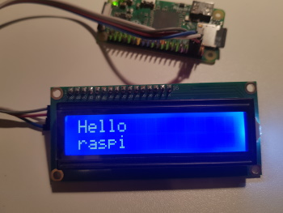

# pi_display_webthing
A web-connected LCD display module

This project provides a [webthing API](https://iot.mozilla.org/wot/) for an I2C LCD module such as a [HD44780 1602 LCD module](https://amzn.to/2TffbbL) on the Raspberry Pi.
As a Webthing, the LCD can be recognized and controlled by *home automation systems* or custom solutions that support the Webthing API.



The pi_display_webthing provides an http webthing endpoint that supports control of the display via http. E.G.
```
# webthing has been started on host 192.168.0.23

curl http://192.168.0.23:8070/properties 

{
    "text": "Hello\n\rraspi",
    "upper_layer_text": "Hello\n\rraspi",
    "upper_layer_text_ttl": -1,
    "middle_layer_text": "uploaded: 41",
    "middle_layer_text_ttl": -1,
    "lower_layer_text": "",
    "lower_layer_text_ttl": -1
}
```
The text *Hallo\n\rraspi* is displayed here. The text of the middle layer *uploaded: 41* is covered by the upper layer.
If the text of the upper level is cleaned up, the displayed text is *uploaded: 41*. By setting the ttl of the layer, 
the text of the layer will disappear after the ttl expires. The value -1 means that ttl is deactivated.

The text of a specific layer can be updated as follows
```
curl -v -X PUT  -d "{\"upper_layer_text\": \"Hello world\"}" http://192.168.1.101:8088/properties/upper_layer_text
```

he RaspberryPi/LCD hardware structure and wiring can look like [HD44780 1602 LCD module](docs/layout.png). By default,
Raspberry Pi OS disables I2C. Please refer to [Configure I2C](docs/configure_i2c.md) to enable I2C and determine the address of the LCD module.

**Docker**
```
sudo docker run -p 8070:8070 --device /dev/i2c-1:/dev/i2c-1 -e name="WebServer" -e i2c_expander=PCF8574 -e i2c_address=0x27  grro/pi_display_webthing:0.2.5
```

