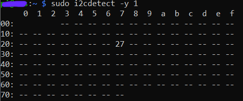

# Configuring I2C

By default, Raspberry Pi OS disables I2C. Before you can use I2C you have to enable the interface. This can be done on command line:
```
sudo raspi-config
```

This launches the raspi-config utility. Here you should select *Interfacing Options*


Then highlight the *I2C* option and activate *Select*


After rebooting the interface will be enabled.

To detect the address of your LCD module you may perform the 
```
sudo i2cdetect -y 1
```
command. This returns the address of 
the I2C connected devices such as shown below


